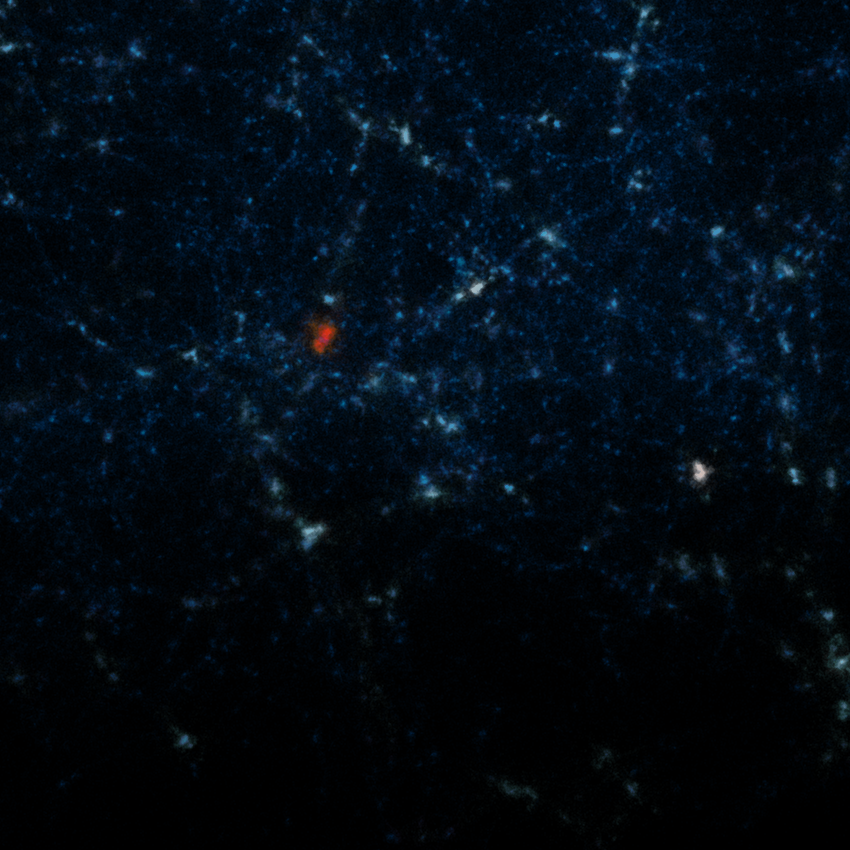
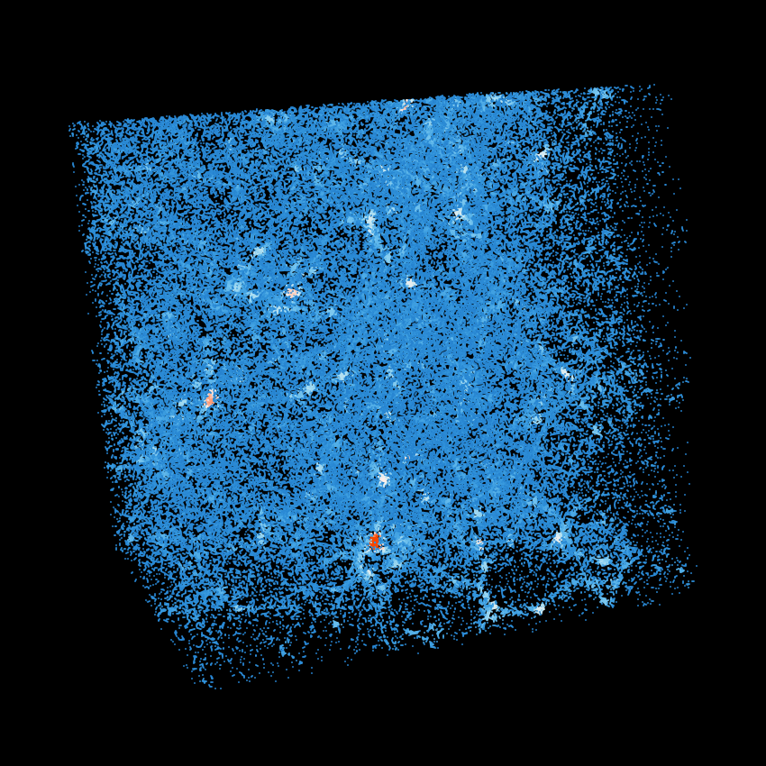

This paraview state file computes the density of a HACC data file and uses it to drive visualization.

Steps: 
1. Download the "PointDensityPlugin.xml" and "PointDensity.pvsm" files
1. Open ParaView
2. Tools -> Manage Plugins ... ->
 a. Find the "GenericIOReader" entry from the "Local Plugins" and check "auto load" and click "Load Selected"
3. Tools -> Manage Plugins ... -> Load New
 a. Locate "PointDensityPlugin.xml" from your hard disk
 b. Find the "PointDensityPlugin" entry from the "Local Plugins" and check "auto load" and click "Load Selected"
4. File -> Load State ...
 a. Locate "PointDensity.pvsm" from your hard disk
 b. Select "Choose File Names" from the "Load State Data File Options" dropdown
 c. Locate the Generio File you want to load from your hard disk

This should create a density field over a GenericIO file. Using the Color Map Editor (View -> Color Map Editor), you should be able to use the transfer fucntion editor to alter the visualization.

Example images:
- 
- 

Author: Nathan Woods